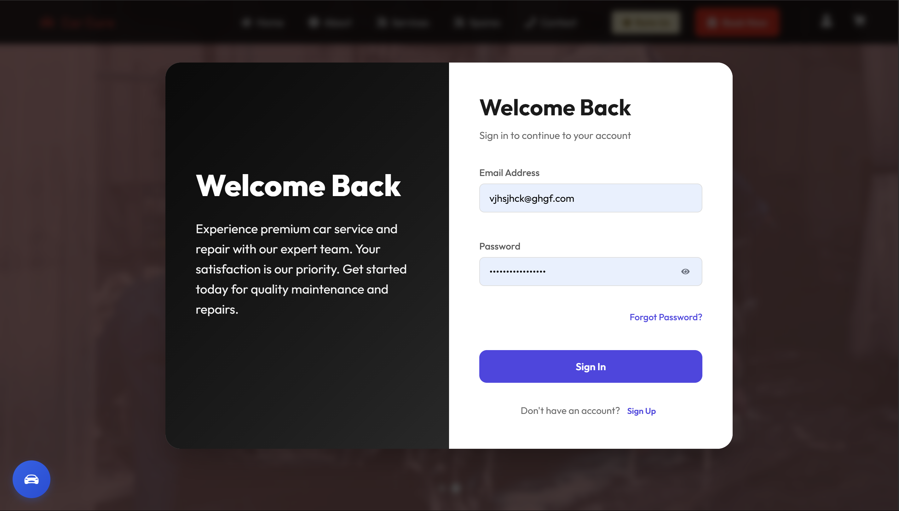
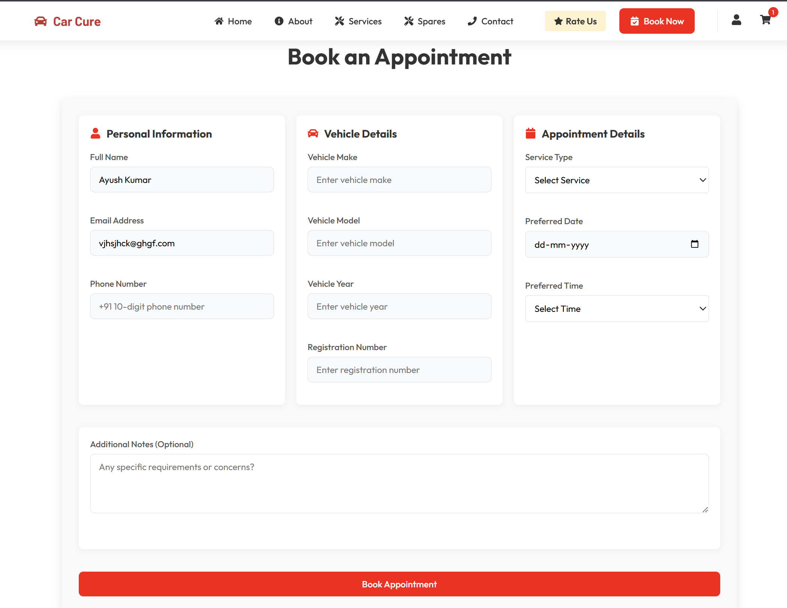
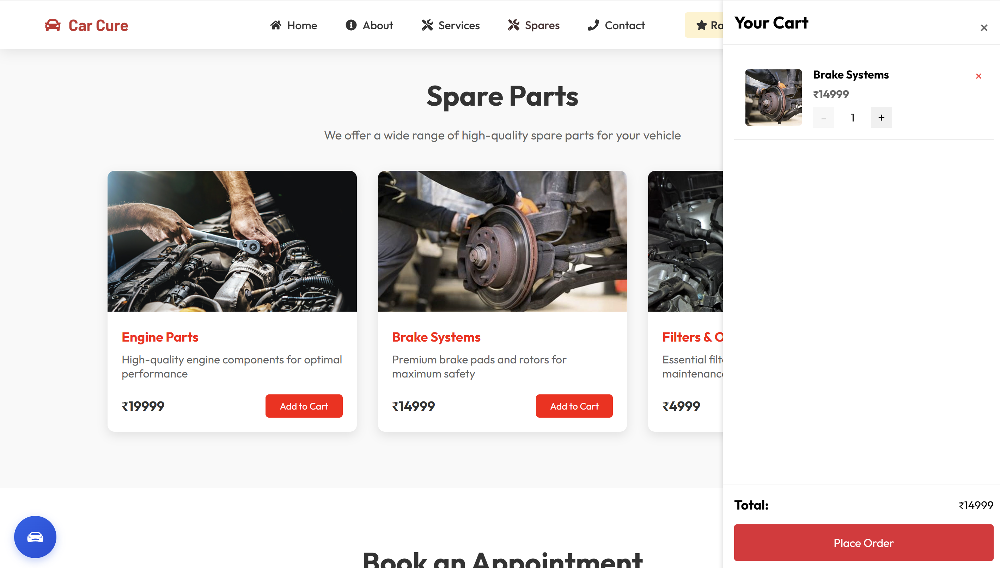
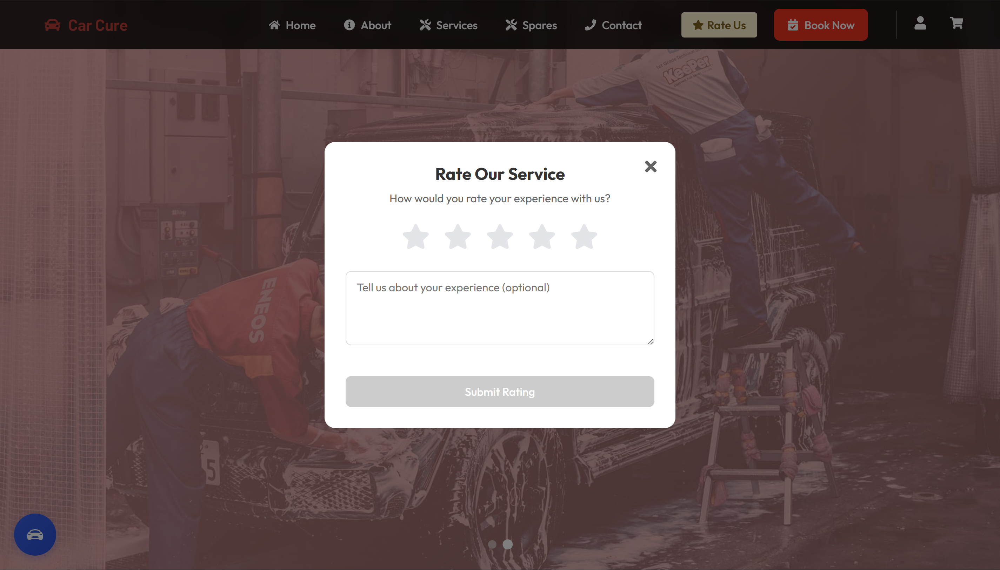

# 🚗 Car Cure — Car Service & Repair Platform (Frontend)

A responsive frontend for booking car repairs and managing services, built using React + Vite with SCSS and Material UI. Includes appointment booking, user login, cart management, rating system, and more.

---

## 🚀 UI Preview

| 🏠 Home | 🔐 Login | 📅 Booking | 🛒 Cart | ⭐ Rate |
|--------|----------|------------|--------|--------|
|  |  |  |  |  |

> 💡 All pages are mobile responsive and styled with modern components using MUI and custom SCSS.

---

## ⚙️ Frontend Tech Stack

  
  
  
  

- ⚛️ React + Vite
- 🎨 SCSS + MUI (Material UI)
- 🔄 Axios for API calls
- 🌐 React Router DOM for navigation

---

## 🔗 Connect with Me

  
  

